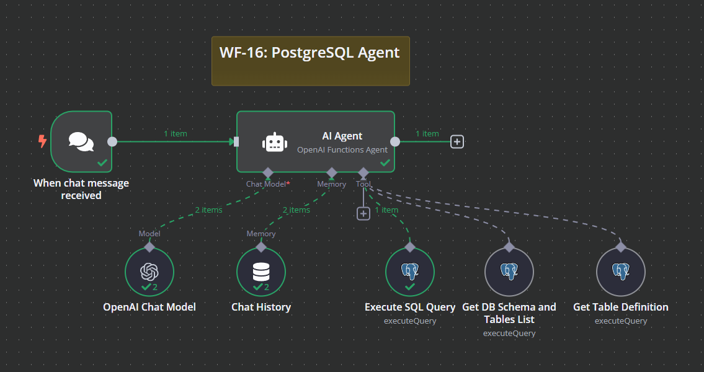

# WF-16: PostgreSQL Agent – n8n Workflow

## 📌 Overview
This **n8n workflow**, `WF-16: PostgreSQL Agent`, acts as an AI-powered **database assistant**, allowing users to query a PostgreSQL database via chat. The workflow enables AI-driven SQL generation, schema discovery, and data retrieval, making it an interactive and intelligent database query tool.

## 🔧 Workflow Components
### 🏗️ Core Modules
1. **💬 Chat Trigger** – Detects user messages requesting database queries.
2. **🤖 AI Agent** – Processes user queries and generates appropriate SQL statements.
3. **📜 Get DB Schema & Tables** – Retrieves database schema and table lists for AI reference.
4. **📑 Get Table Definition** – Fetches column details, data types, and foreign key relationships.
5. **🗄️ Execute SQL Query** – Runs AI-generated SQL queries on the PostgreSQL database.
6. **📚 Chat History** – Maintains previous interactions for contextual understanding.

## ⚙️ How It Works
1. 💬 A user sends a database-related query via chat (e.g., "Show me sales data for 2023").
2. 🤖 The **AI Agent** analyzes the request and constructs an SQL query.
3. 📜 The **Get DB Schema & Tables** node retrieves relevant database schema information.
4. 📑 If needed, the **Get Table Definition** node fetches table structures and relationships.
5. 🗄️ The **Execute SQL Query** node runs the AI-generated SQL query.
6. 📚 The **Chat History** node stores interactions to improve contextual responses.
7. 📊 The AI formats and sends the final data response back to the user.

## 📷 Workflow Screenshot

## 🚀 Setup Instructions
- 📥 **Import the workflow** into `n8n`.
- 🔑 **Ensure API credentials** for PostgreSQL and OpenAI are configured.
- ✅ **Activate the workflow** to start executing AI-powered database queries.

## 📝 Notes
- ⚠️ The workflow is **inactive by default**.
- 🛠️ Modify AI prompts to refine SQL query generation.
- 💡 Can be enhanced to support **additional database types** beyond PostgreSQL.
